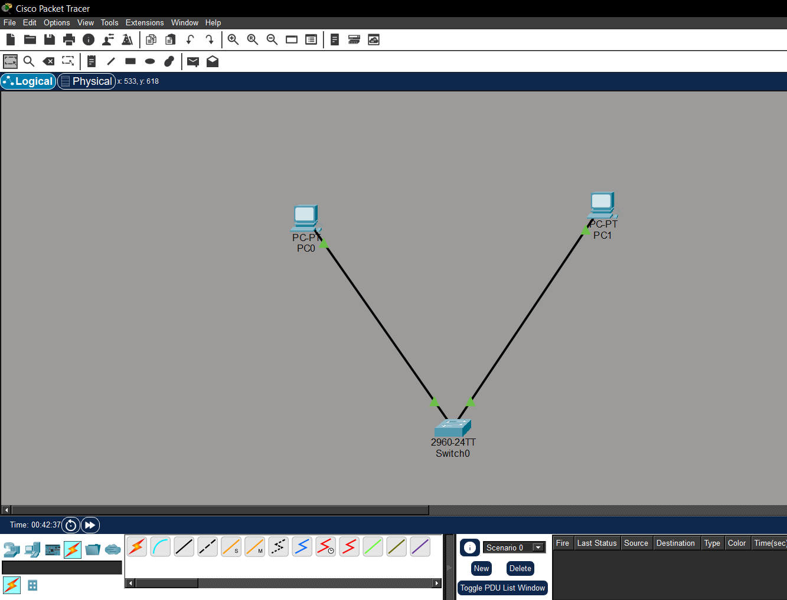
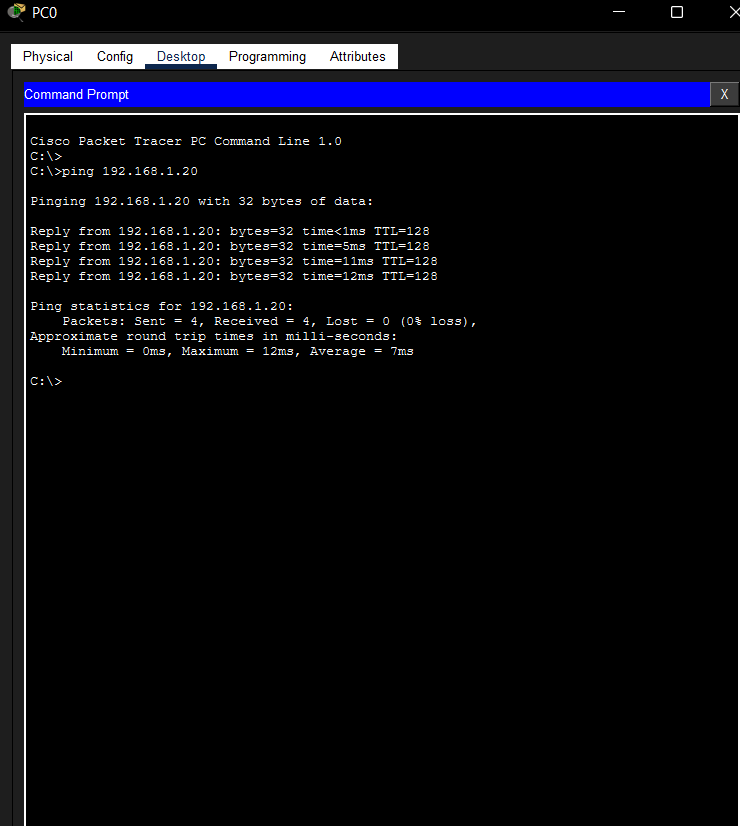

# Lab 01 – Building My First LAN

## Objective

Build a simple Local Area Network (LAN) using two PCs and one Cisco 2960 switch. Configure static IPv4 addresses and verify connectivity using the `ping` command.

## Devices Used

| Device | Quantity |
|---------|---------:|
| PC | 2 |
| Cisco 2960-24TT Switch | 1 |
| Copper Straight-Through Cable | 2 |

## Network Topology

## IP Addressing

| Device | IP Address | Subnet Mask |
|---------|------------|-------------|
| PC0 | 192.168.1.10 | 255.255.255.0 |
| PC1 | 192.168.1.20 | 255.255.255.0 |

## Configuration Summary

- Added one Cisco 2960-24TT switch.
- Connected both PCs using Copper Straight-Through cables.
- Assigned static IPv4 addresses.
- Verified connectivity with the `ping` command.

## Verification

## Skills Learned

- Creating a basic LAN
- Connecting devices with Ethernet cables
- Configuring static IPv4 addresses
- Testing connectivity with `ping`

## Cybersecurity Connection

SOC analysts often investigate communication between devices on a local network. Understanding how hosts communicate on a LAN is an essential skill for analyzing network traffic, firewall events, and packet captures.